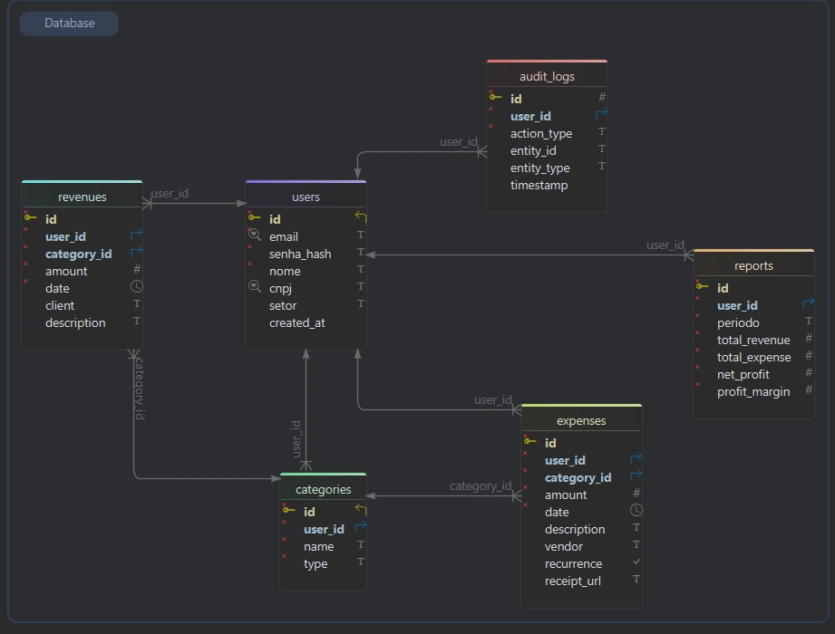

# Modelagem do Banco de Dados (Diagrama ER simplificado)

# Preview

# Entidades e atributos:
## users

- id (PK, UUID)

- email (único, not null)

- senha_hash (not null)

- nome (not null)

- cnpj (único, opcional)

- setor

- created_at

## categories

- id (PK, SERIAL)

- user_id (FK → users.id)

- name

- type (ENUM: 'revenue', 'expense')

## expenses

- id (PK, UUID)

- user_id (FK → users.id)

- category_id (FK → categories.id)

- amount

- date

- description

- vendor

- recurrence

- receipt_url

## revenues

- id (PK, UUID)

- user_id (FK → users.id)

- category_id (FK → categories.id)

- amount

- date

- client

- description

## reports:

- id (PK, UUID)

- user_id (FK → users.id)

- periodo

- total_revenue

- total_expense

- net_profit

- profit_margin

## audit_logs

- id (PK, BIGSERIAL)

- user_id (FK → users.id)

- action_type

- entity_id

- entity_type

- timestamp

### Relacionamentos:

- users 1:N categories

- users 1:N expenses

- users 1:N revenues

- users 1:N reports

- users 1:N audit_logs

- categories 1:N expenses

- categories 1:N revenues
